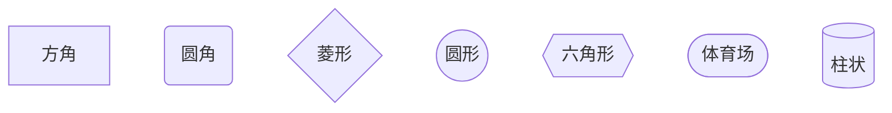
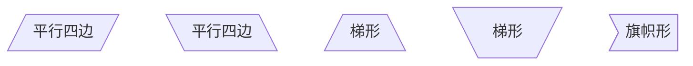
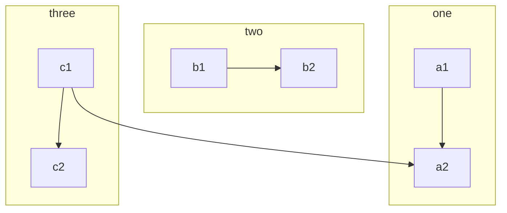
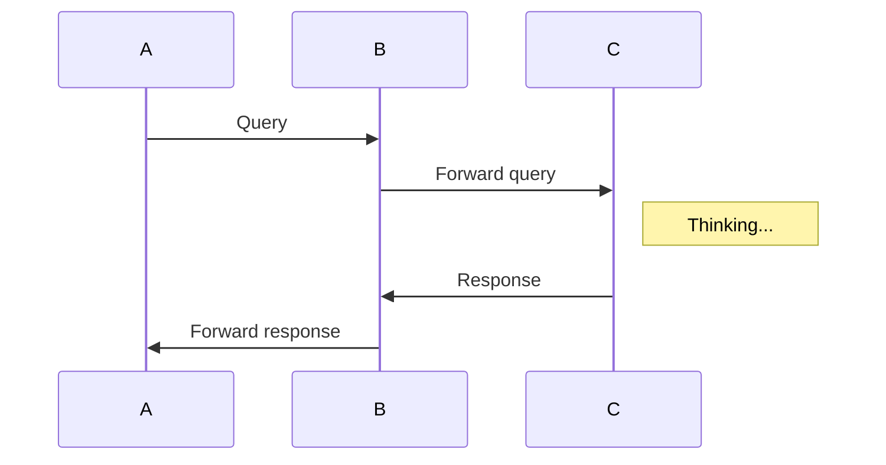

# markdown / Mermaid 绘图

[toc]

## 流程图

### 基本形状



### 方形变体形状



### 线形

```mermaid
    graph LR
    
    A -- 描述 --- B
    A -- 描述 --> B
    A -. 描述 .-> B
    A == 描述 ==> B  %% 粗箭头
    
    C --- D
    C --> D
    C -.- D
    C -.->D
    C ==> D
```

### 子流程图



## 时序图



## 甘特图

```mermaid
gantt
dateFormat  YYYY-MM-DD
title Shop项目交付计划

section 里程碑 0.1
数据库设计          :active,    p1, 2016-08-15, 3d
详细设计            :           p2, after p1, 2d

section 里程碑 0.2
后端开发            :           p3, 2016-08-22, 20d
前端开发            :           p4, 2016-08-22, 15d

section 里程碑 0.3
功能测试            :       p6, after p3, 5d
上线               :       p7, after p6, 2d
交付               :       p8, afterp7, 2d
```

## 饼图

```mermaid
pie title What Voldemort doesn't have?
         "FRIENDS" : 2
         "FAMILY" : 3
         "NOSE" : 45
 ```
