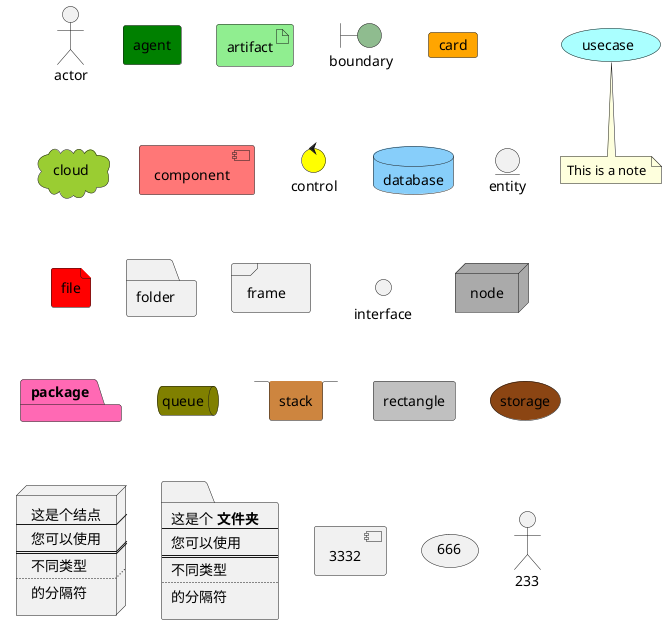
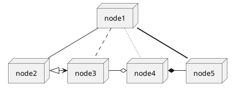
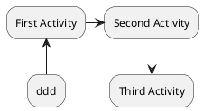
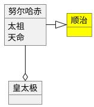
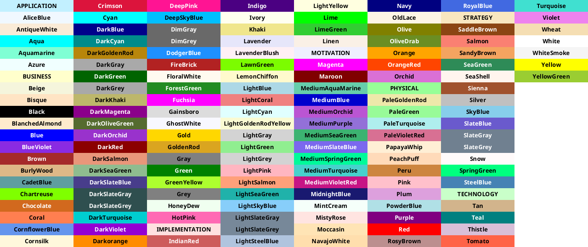
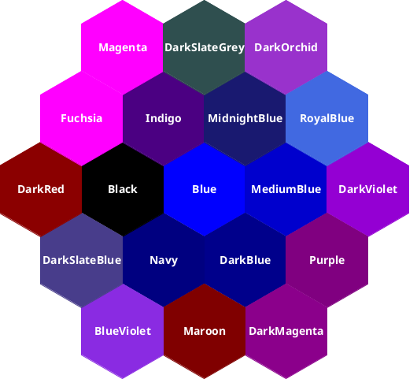
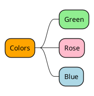

# PlantUML













甘特图

```puml
@startuml
project starts the 2018/03/29
saturday are closed
2018/04/17 to 2018/04/19 is closed
[Prototype design] lasts 14 days
[Test prototype] lasts 4 days
[Test prototype] starts at [Prototype design]'s end
[Prototype design] is colored in Fuchsia/FireBrick
[Test prototype] is colored in GreenYellow/Green
[小论文] lasts 3 days and is 30% complete
@enduml
```


