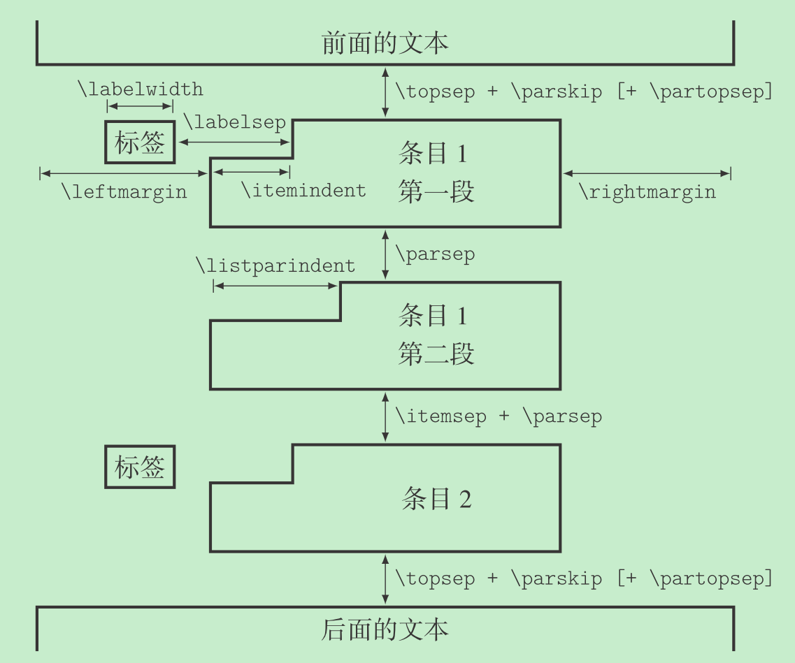

## 列表中的长度参数



## 无序列表行间距过大

```latex
\begin{itemize}
    \setlength{\itemsep}{0pt}
    \setlength{\parsep}{0pt}
    \item 233
    \item 666
\end{itemize}
或者
\begin{itemize}[parsep=0pt, itemsep=0pt]
    \item 233
    \item 666
\end{itemize}
```
