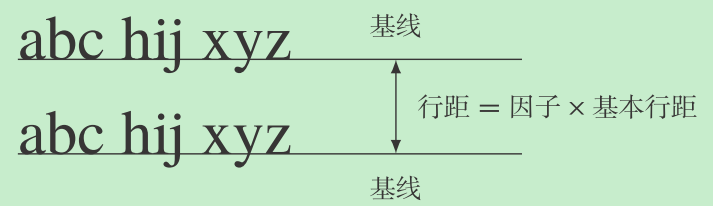

## 行距

- 设置**字号**时，已经默认设置了**基本行距**为字体大小的 1.2 倍
- `\linespread{<>}` 设置**实际行距**为基本行距的**倍数因子**
- 该设定与 Word 中的行距概念相同



## 段落

'\\' 断行（下一行是旧段，默认不缩进）

`\par` 分段（下一行是新段，默认缩进）

`\parindent<>` 段前缩进

`\noindent` 禁用缩进

`\parskip<>` 段间距，默认为橡皮长度 {0pt plus 1pt}

`\leftskip<>` `\rightskip<>` 段落左右边距，用以控制段落宽度

### 对齐方式

||左对齐|右对齐|居中对齐|
|--|--|--|--|
|声明命令|`\raggedright`|`\raggedleft`|`\centering`|
|环境命令|`flushleft` |`flushright` |`center` |

（注：ragged 参差不齐的）

```latex
\raggedright
这段左对齐

\begin{center} % 环境会在段落前后增加一小段垂直间距以示强调
这段居中
\end{center}
```
