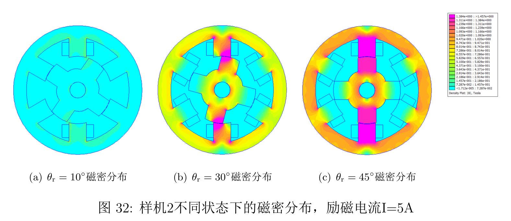
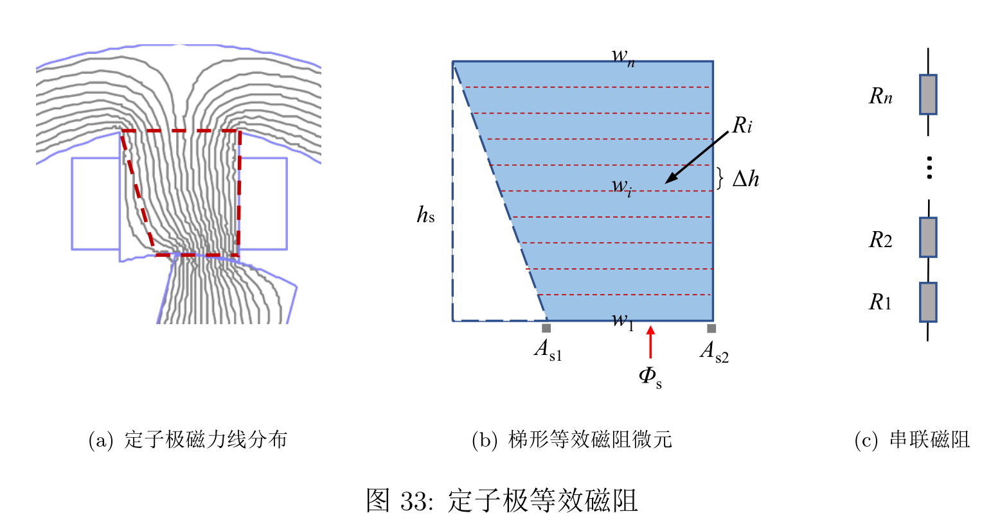

# 插图

[toc]

## 子图

```latex
\usepackage{subfigure}

\begin{figure}[htb]
    \centering
    \subfigure[$\theta_{\rm r} = 10^\circ$磁密分布]{
        \includegraphics[width = .25\textwidth]{chapter3/3_2/img/10.png}
    }
    \subfigure[$\theta_{\rm r} = 30^\circ$磁密分布]{
        \includegraphics[width = .25\textwidth]{chapter3/3_2/img/30.png}
    }
    % \quad
    \subfigure[$\theta_{\rm r} = 45^\circ$磁密分布]{
        \includegraphics[width = .25\textwidth]{chapter3/3_2/img/45.png}
    }
    \subfigure{
        \includegraphics[width = .1\textwidth]{chapter3/3_2/img/legend.png}
    }
    \caption{样机2不同状态下的磁密分布，励磁电流I=5A}
    \label{fig:bsaturation}
\end{figure}
```



## 插图剪裁

+ `trim`={left, bottom, right, top}
+ `clip`, 表示剪裁部分不显示
+ `quad`,`qquad`, 子图之间加空格，可以调整子图之间的间隔

```latex
\usepackage{subfigure}

\begin{figure}[htb]
    \centering
    \subfigure[定子极磁力线分布]{
        \includegraphics[trim = {2.5cm, 0, 13.5cm, 24cm}, clip]{chapter3/3_2/img/R.pdf}
    }
    \subfigure[梯形等效磁阻微元]{
        \includegraphics[trim = {9cm, 0, 6cm, 24cm}, clip]{chapter3/3_2/img/R.pdf}
    }
    \qquad
    \subfigure[串联磁阻]{
        \includegraphics[trim = {17cm, 0, 2cm, 24cm}, clip]{chapter3/3_2/img/R.pdf}
    } 
    \caption{定子极等效磁阻}
    \label{fig:spEC}
\end{figure}
```


