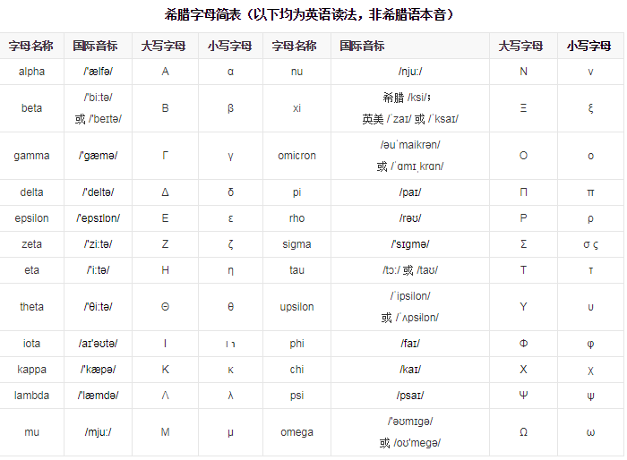

# 数学符号、公式

同时适用于 Markdown 和 Latex. 
Markdown 在 Winddows 下使用 `KaTeX` 解析器有部分符号无法渲染，需使用 `MathJax` 解析器。二者依赖的底层协议都是 `Tex`，二者优缺点：

+ MathJax 有着更全面的解析，但却丧失了体积轻量这一优势。
+ KaTeX 则更加灵活，以高速渲染为优势。

[toc]

## 数学符号

### 上下标

$x^{y^z}=(1+e^x)^{-2xy^w}$

上面输入的上下标都是在字符的右侧，要想在左侧或者两侧都写上下标，那么需要使用 `\sideset` 语法。

示例：$\sideset{^1_2}{^3_4} {ABC}$

### 分数

$\frac 1 2, \dfrac a b$, $1\over x+1$

### 算术运算符

$\pm,\mp,\times,\cdot,\div,\sqrt[9]{3},\sqrt{3},\mid,\log,\lg,\ln,\sum,\prod,\coprod$

### 比较运算符

$\le,\leq,\ge,\geq,\ne,\neq,\not=,\not>,\not<,\approx,\equiv$

### 集合运算符

$\emptyset,\in,\notin,\subset,\subseteq,\not\subset,\supset,\supseteq,\not\supset$
$\bigcap,\bigcup,\bigvee,\bigwedge,\biguplus,\bigsqcup$

### 三角运算符

$\Diamond,\Box,\triangle,\perp,\bot,\angle,30^\circ,\sin,\cos,\tan,\cot,\sec,\csc$

### 微积分运算符

$\rm d \mit y,y\prime,\nabla,\partial,\int,\iint,\iiint,\oint,\lim,\infty$

### 逻辑运算符

$\because,\therefore,\forall,\exists$

### 戴帽符号

$\vec y,\dot y,\hat y,\check y,\breve y, \hbar$

### 连线符号

$\overline{a+b+c+d} \quad \underline{a+b+c+d} \quad \underbrace{a+b+c+d}$
$\overbrace{1+2+\cdots+100}$

$\begin{matrix} 5050 \\ \overbrace{ 1+2+\cdots+100 } \end{matrix}$

### 箭头符号

$\uparrow,\downarrow,\Uparrow,\Downarrow$
$\rightarrow,\to,\leftarrow,\gets,\Rightarrow,\Leftarrow$
$\longrightarrow,\longleftarrow,\Longrightarrow,\Longleftarrow$

### 圆圈符号/省略号

$\ast,\bigodot,\bigotimes,\bigoplus,\ldots,\cdots,\vdots,\ddots$

### 括号

$(),[],\langle\rangle,\{ \},\overbrace{abc},\underbrace{abc}$

$\bigl( \Bigl( \biggl( \Biggl( 空格\quad占位符 \bigr\} \Bigr\} \biggr\} \Biggr\}$

有时候括号需要大号的，普通括号不好看，此时需要使用`\left`和`\right`让括号随内容变化大小。
示例：$(\frac{x}{y})^8，\left(\frac{x}{y} \right)^8$

`\left`和`\right`必须成对出现，对于不显示的一边可以使用 . 代替。
示例：$\left.\frac{{\rm d}u}{{\rm d}x} \right| _{x=0}$

## 希腊字母

### 字母表

|                |               |                    |          |                       |
| -------------- | ------------- | ------------------ | -------- | --------------------- |
| $\alpha$       | $\beta$       | $\gamma$           | $\delta$ | $\epsilon\varepsilon$ |
| $\zeta$        | $\eta$        | $\theta\vartheta$  | $\iota$  | $\kappa$              |
| $\lambda$      | $\mu$         | $\nu$              | $\xi$    | $\omicron$            |
| $\pi \varpi$   | $\rho\varrho$ | $\sigma \varsigma$ | $\tau$   | $\upsilon$            |
| $\phi \varphi$ | $\chi$        | $\psi$             | $\omega$ |                       |

### 希腊字母——英文读音对照表



## 数学公式

### 行内公式调整间距

示例：$1\over{a + b}$，$\displaystyle\frac{1}{a + b}$

### 矩阵

$$A=
\left\{
 \begin{matrix}
   a & b & c & d & e\\
   f & g & h & i & j \\
   k & l & m & n & o \\
   p & q & r & s & t
  \end{matrix}
\right. \tag{7}
$$

$$
\left[
 \begin{matrix}
   a & b & \cdots & e\\
   f & g & \cdots & j \\
   \vdots & \vdots & \ddots & \vdots \\
   p & q & \cdots & t
  \end{matrix} \tag{7}
\right]
$$

$$
\left[
    \begin{array}{cc|c}
      1 & 2 & 3 \\
      4 & 5 & 6
    \end{array}
\right]
$$

### 长公式换行

#### 无需对齐

$$
\begin{multline}
    x=a+b+c+ \\
    d+e+f+g
\end{multline}
$$

#### 需要对齐

用`split` 环境，它本身不能单独使用，因此也称作`次环境`，必须包含在`equation` 或其它数学环境内。

$$
\begin{equation}
    \begin{split}
        x=&a+b+c+ \\
        &d+e+f+g
    \end{split}
\end{equation}
$$

### 分段函数

`\case`环境，自带大括号。也可用于方程组。
$$
q(x,t)=
\begin{cases}
  (t-k+1)x^2,\quad \ \ & t\in\big(k-1,k-\dfrac{1}{2}\big],\\
  (k-t)x^2, \quad \ \ & t\in\big(k-\dfrac{1}{2},k\big],
\end{cases}
$$


### 多行独立公式

$$
\begin{eqnarray}
    x^n+y^n &=& z^n \\
    x+y &=& z
\end{eqnarray}
$$

### 指定字体

|   字体   |   text    |  数学斜体   |   加粗    |    花体    |  意大利体  |  等线体   |  打字机体  | 
| ------- | --------- | ---------- | --------- | ---------- | --------- | --------- | --------- |
| 代码格式 | $\rm ABC$ | $\mit ABC$ | $\bf ABC$ | $\cal ABC$ | $\it ABC$ | $\sf ABC$ | $\tt ABC$ |

### 控制字体相对大小

在数学模式中，有四个控制字体相对大小的命令，即

```latex
\displaystyle D  % 行间公式的基本尺寸
\textstyle T % 行内公式的基本尺寸大小
\scriptstyle S % 一级角标的尺寸
\scriptscirptstyle % SS 二级角标的尺寸大小
```

## 其他

### LaTex 中数学正体表示

`\mathrm`: 作用范围只限后面紧跟的第一个字符
`\rm`: 作用范围为其后所有字符, 以后版本会**不支持**
