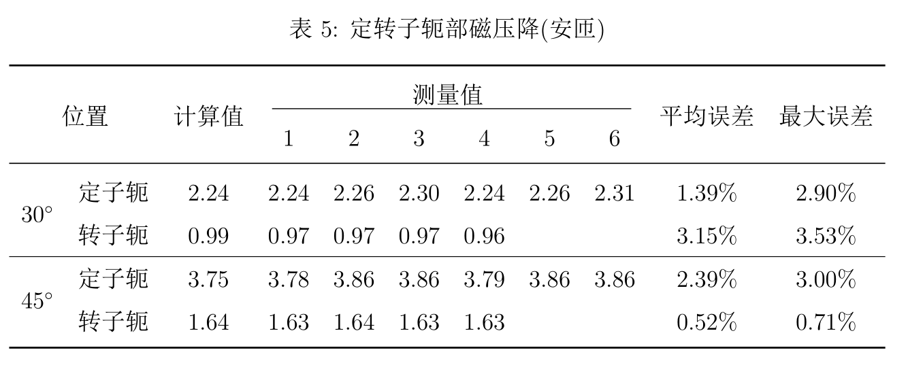

# 表格

## 复杂表格

+ 合并列 `\multicolumn`
+ 合并行 `\multirow`, 需用到`multirow`包
+ 表中短横线, 空格实现 `\quad`或者`\qquad`

```latex
\usepackage{multirow}

\begin{table}[ht]
    \centering
    \topcaption{定转子轭部磁压降(安匝)}
    \label{table:yokedu}
    \begin{tabular}{ccccccccccc}
        \toprule
        \multicolumn{2}{c}{\multirow{2}{*}{位置} } & \multirow{2}{*}{计算值} & \multicolumn{6}{c}{\underline{\qquad\qquad\qquad 测量值 \qquad\qquad\qquad}} & \multirow{2}{*}{平均误差} & \multirow{2}{*}{最大误差} \\
        & & & 1 & 2 & 3 & 4 & 5 & 6  \\
        \midrule
        \multirow{2}{*}{$30^\circ$} & 定子轭 & 2.24 & 2.24 & 2.26 & 2.30 & 2.24 & 2.26 & 2.31 & 1.39\% & 2.90\% \\
        & 转子轭 & 0.99 & 0.97 & 0.97 & 0.97 & 0.96 & & & 3.15\% & 3.53\% \\
        \hline
        \multirow{2}{*}{$45^\circ$} & 定子轭 & 3.75 & 3.78 & 3.86 & 3.86 & 3.79 & 3.86 & 3.86 & 2.39\% & 3.00\% \\
        & 转子轭 & 1.64 & 1.63 & 1.64 & 1.63 & 1.63 & & & 0.52\% & 0.71\% \\
        \bottomrule
    \end{tabular}
\end{table}
```

**效果**

