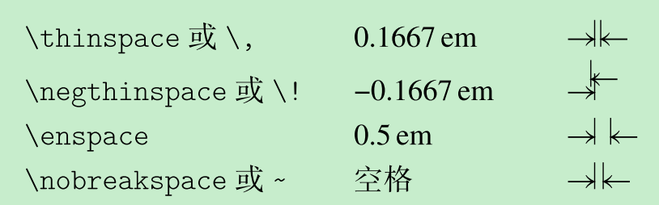
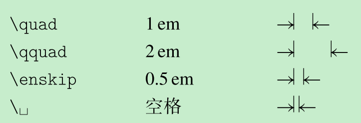
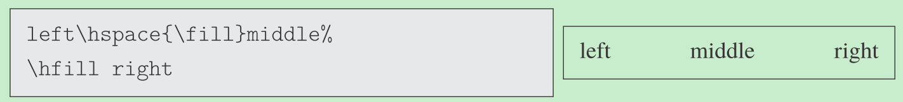

[toc]

## 长度单位

- `pt`: point 磅，1/72.27 inch
- `in`: inch 英寸
- `cm`: 2.54cm = 1 in
- `ex`: 当前字体下，小写 `x` 的高度
- `em`: 当前字体下，大写 `M` 的宽度
- `sp`: scaled point，TeX 中的最小长茺单位，所有长度均是其整数倍。1 pt = 65536 sp

## 水平间距

### 不可换行的水平间距

### 可换行的水平间距

### \hspace

- `\hspace{<>}` 指定水平间距，用于分隔左右内容
- 强制断行的行首时，会被忽略，可用`\hspace*{<>}`
- **橡皮长度**
  - 距离可随内容伸缩，用于行末对齐
  - `\hspace{<普通长度>plus<可伸长长度>minus<可缩短长度>}`
  - `\hfill` = `\hspace{\fill}` 从0到无限长的橡皮长度
    + `\hrulefill` 功能类似，中间用横线填充
    + `\dotfill` 功能类似，中间用圆点填充

## 长度设置

`\setlength{}{<>}`
